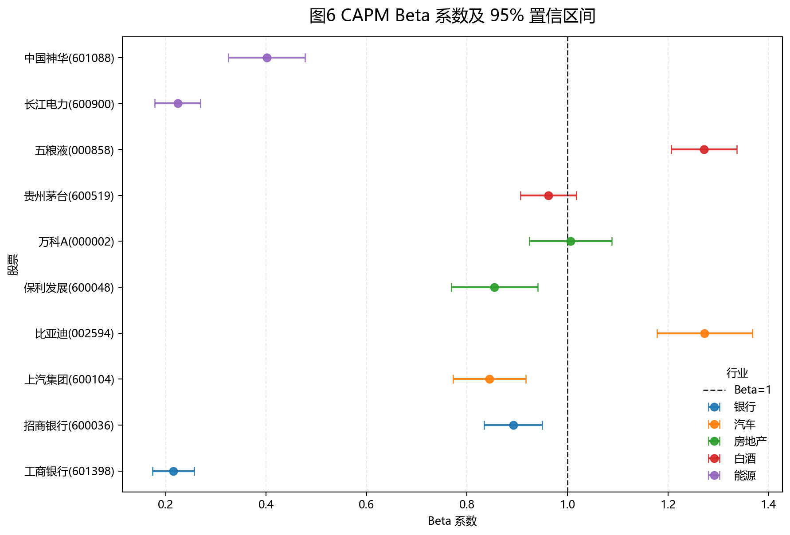
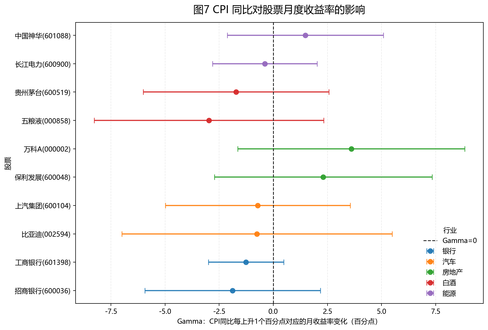

# CAPM 与宏观敏感性

## CAPM 模型

CAPM 回归模型设定为：

$$r_{i,t}-r_f=\alpha_i+\beta_i(r_{m,t}-r_f)+\varepsilon_{i,t}$$

其中 $r_{i,t}$ 为个股日对数收益率，$r_{m,t}$ 为沪深 300 日对数收益率，$r_f$ 为日频无风险利率，按年化 2.0% 换算为 $0.02/252$。

| 股票 | 行业 | Alpha | Alpha p值 | Beta | 95% CI | R2 |
|---|---|---:|---:|---:|---:|---:|
| 招商银行(600036) | 银行 | 0.000051 | 0.8846 | 0.892 | [0.834, 0.950] | 0.371 |
| 工商银行(601398) | 银行 | 0.000271 | 0.2824 | 0.215 | [0.174, 0.257] | 0.062 |
| 比亚迪(002594) | 汽车 | 0.001057 | 0.0659 | 1.273 | [1.178, 1.368] | 0.309 |
| 上汽集团(600104) | 汽车 | -0.000409 | 0.3481 | 0.844 | [0.772, 0.917] | 0.255 |
| 万科A(000002) | 房地产 | -0.001421 | 0.0042 | 1.006 | [0.924, 1.088] | 0.272 |
| 保利发展(600048) | 房地产 | -0.000597 | 0.2496 | 0.855 | [0.769, 0.941] | 0.198 |
| 五粮液(000858) | 白酒 | -0.000291 | 0.4617 | 1.272 | [1.206, 1.337] | 0.485 |
| 贵州茅台(600519) | 白酒 | 0.000080 | 0.8117 | 0.962 | [0.907, 1.017] | 0.430 |
| 长江电力(600900) | 能源 | 0.000286 | 0.3003 | 0.224 | [0.178, 0.270] | 0.056 |
| 中国神华(601088) | 能源 | 0.000790 | 0.0881 | 0.401 | [0.325, 0.478] | 0.064 |

Beta 大于 1 的股票包括比亚迪、万科A 和五粮液，说明这些股票相对沪深 300 更敏感。比亚迪和万科A分别属于汽车和房地产，较符合周期性行业对经济景气和风险偏好更敏感的特征；五粮液 Beta 也较高，说明样本期内消费龙头估值波动同样受到市场风险偏好影响。

Alpha 显著异于零的股票是万科A，且 Alpha 为负，表示在控制市场超额收益后仍存在 CAPM 难以解释的负向异常收益。R2 最高的是五粮液，说明沪深 300 对其日收益率解释力较强；R2 最低的是长江电力，说明其收益更多受公司现金流稳定性、能源资产属性或独立行业因素影响。

## CPI 对股票月度收益率的影响

月度宏观回归模型为：

$$r_{i,t}^{月}=\alpha_i+\gamma_i CPI_t+\varepsilon_{i,t}$$

其中 CPI 同比单位为百分比，$\gamma_i$ 表示 CPI 同比每上升 1 个百分点时，股票月度收益率的平均变化。

| 股票 | 行业 | Gamma | Gamma p值 | 95% CI | R2 |
|---|---|---:|---:|---:|---:|
| 招商银行(600036) | 银行 | -1.880 | 0.3578 | [-5.936, 2.175] | 0.013 |
| 工商银行(601398) | 银行 | -1.262 | 0.1524 | [-3.001, 0.478] | 0.031 |
| 比亚迪(002594) | 汽车 | -0.754 | 0.8101 | [-6.992, 5.485] | 0.001 |
| 上汽集团(600104) | 汽车 | -0.719 | 0.7377 | [-4.987, 3.549] | 0.002 |
| 万科A(000002) | 房地产 | 3.598 | 0.1753 | [-1.646, 8.842] | 0.028 |
| 保利发展(600048) | 房地产 | 2.307 | 0.3630 | [-2.723, 7.337] | 0.013 |
| 五粮液(000858) | 白酒 | -2.971 | 0.2673 | [-8.276, 2.333] | 0.019 |
| 贵州茅台(600519) | 白酒 | -1.718 | 0.4265 | [-6.006, 2.570] | 0.010 |
| 长江电力(600900) | 能源 | -0.391 | 0.7470 | [-2.802, 2.020] | 0.002 |
| 中国神华(601088) | 能源 | 1.479 | 0.4152 | [-2.123, 5.080] | 0.010 |

从显著性看，CPI 同比对 10 只股票月度收益率的影响在 5% 水平下均不显著，说明单一宏观变量难以稳定解释个股月度收益。行业层面看，房地产样本的 Gamma 更偏正，白酒和银行样本更偏负，但置信区间较宽，解释时应谨慎。
