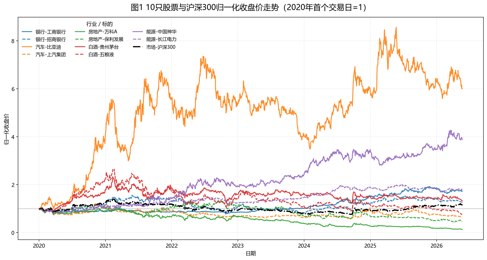
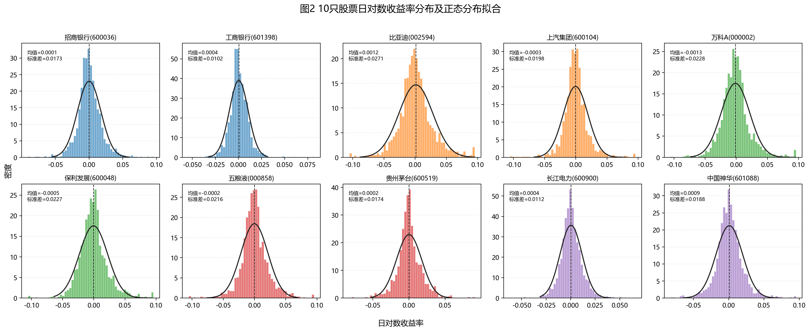
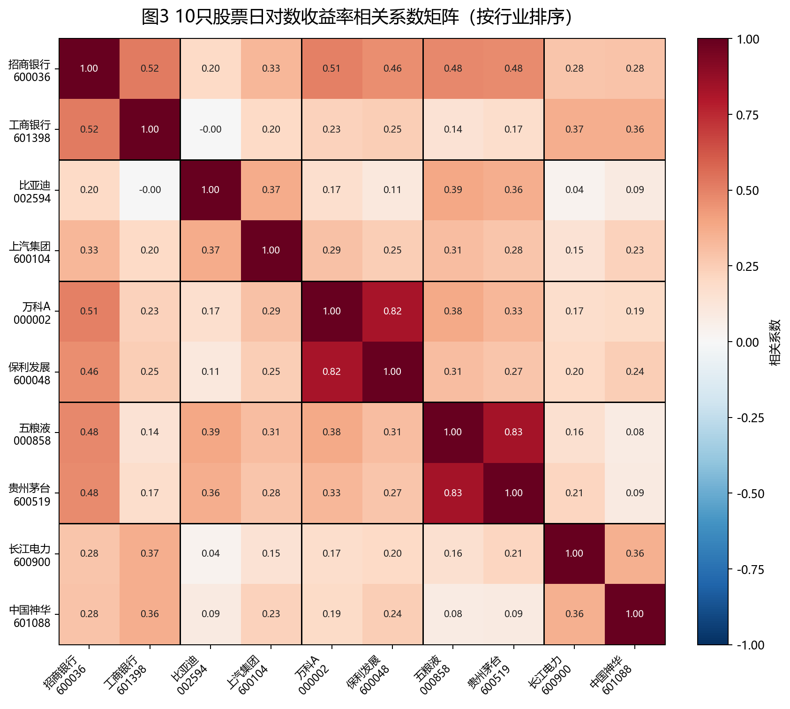
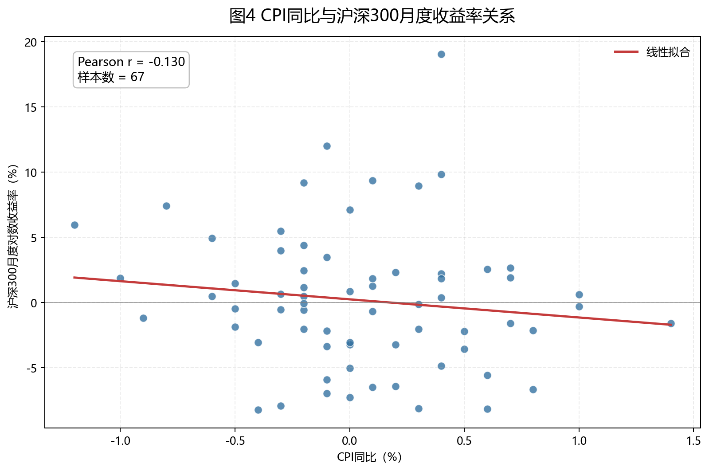
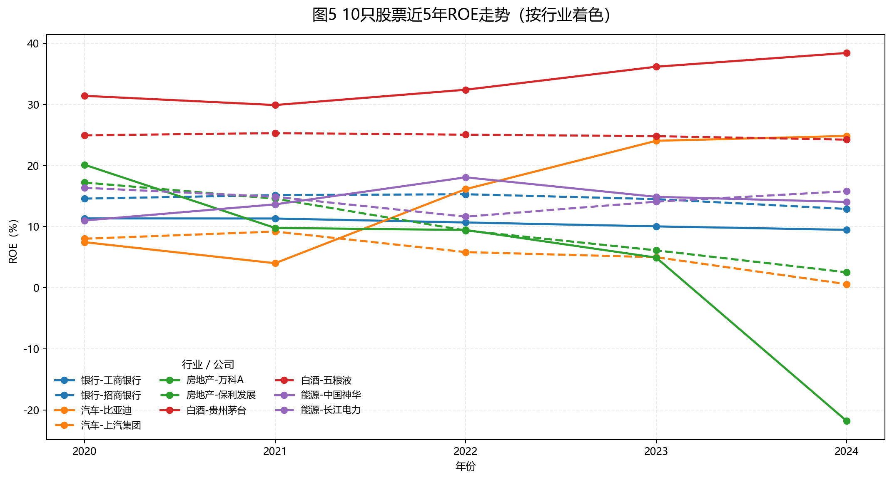

# 统计描述与可视化

## 基本统计量

下表汇总了 10 只股票日对数收益率的描述性统计。年化均值反映样本期内的平均收益水平，年化波动率衡量收益波动强度，偏度和峰度刻画收益分布形态，最大回撤则反映投资者可能遭遇的极端下行风险。

| 股票 | 行业 | 年化均值 | 年化波动率 | 偏度 | 峰度 | 最大回撤 |
|---|---|---:|---:|---:|---:|---:|
| 招商银行(600036) | 银行 | 3.74% | 27.52% | 0.270 | 3.226 | -50.94% |
| 工商银行(601398) | 银行 | 8.94% | 16.23% | 0.451 | 5.775 | -20.20% |
| 比亚迪(002594) | 汽车 | 29.29% | 43.07% | 0.310 | 2.111 | -52.54% |
| 上汽集团(600104) | 汽车 | -7.87% | 31.48% | 0.348 | 5.370 | -53.99% |
| 万科A(000002) | 房地产 | -33.29% | 36.27% | 0.654 | 3.250 | -87.81% |
| 保利发展(600048) | 房地产 | -12.61% | 36.11% | 0.557 | 3.155 | -67.65% |
| 五粮液(000858) | 白酒 | -4.67% | 34.33% | 0.095 | 3.368 | -71.57% |
| 贵州茅台(600519) | 白酒 | 4.50% | 27.58% | 0.262 | 3.637 | -47.48% |
| 长江电力(600900) | 能源 | 9.33% | 17.73% | 0.370 | 3.575 | -17.54% |
| 中国神华(601088) | 能源 | 22.10% | 29.82% | 0.316 | 3.289 | -21.47% |

从统计结果看，比亚迪和中国神华的年化收益较高，但比亚迪的波动率也显著偏高，体现成长型或高弹性资产的风险收益特征。房地产样本股的最大回撤明显更深，说明行业景气下行对股价形成了持续压力。

## 归一化价格走势

图中所有股票均以 2020 年首个交易日为 1 进行归一化，因而可以直接比较累计涨跌幅。沪深 300 作为黑色基准线，帮助判断个股收益来自市场整体上涨还是行业与公司特质。

## 日收益率分布

收益率分布普遍存在尖峰厚尾特征，说明实际市场中的极端涨跌比正态分布假设更常见。对于风险管理而言，仅依赖均值和标准差可能低估尾部风险。

## 收益率相关系数

相关系数热力图按行业排序，便于观察行业内部与跨行业相关性的差异。若同一行业块内相关性较高，说明行业共同冲击较强；若跨行业相关性也较高，则反映市场系统性因素在样本期内影响较大。

## 宏观指标与沪深 300

CPI 同比与沪深 300 月度收益率的散点图用于观察通胀水平与股市收益之间的线性关系。二者关系可能受政策预期、企业成本、需求强弱和估值折现率共同影响，因此应结合经济背景解释。

## ROE 跨公司比较

ROE 走势反映企业盈利能力和资本使用效率。白酒、银行、能源等行业通常更强调稳定盈利和现金流，而房地产行业 ROE 下行则与行业景气和资产周转压力有关。
